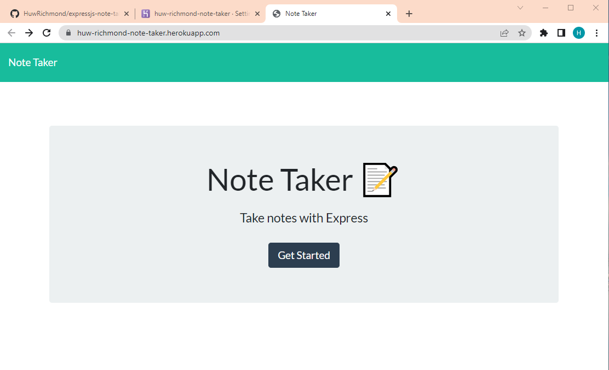
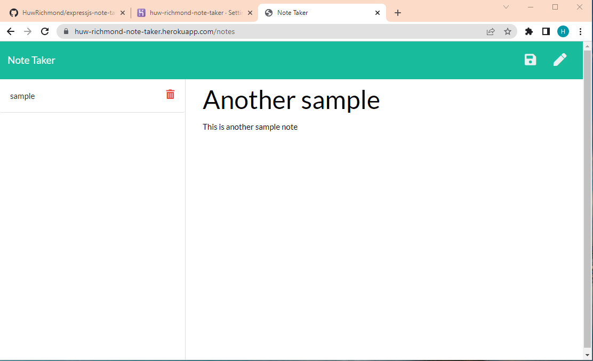

# Express js Note Taker
> This application allows a user to write and save notes via an html page. The user begins writing a note and once they have any text in the main body of the note, an icon shows up for them to save the note. Upon saving the note, the note displays on the left side of the page. The user can add more notes and is able to view and delete notes at their leisure.
 
## Table of contents
* [User story](#user-story)
* [General info](#general-info)
* [Screenshots](#Screenshots)
* [Technologies](#technologies)
* [Live Link](#example-html)
* [Code Snippet](#code-snippet)
* [Sources](#sources)
* [Contact](#contact)

## User story
AS A small business owner  
I WANT to be able to write and save notes  
SO THAT I can organize my thoughts and keep track of tasks I need to complete  

## General info
This app is deployed on Heroku and uses NPM Express to operationalize the back-end server for the app.

## Screenshots

## Technologies
* HTML
* CSS
* JavaScript
* Node.js
* NPM Express
* NPM Generate Unique Id

## Live link
[Express.js Note Taker Application](https://huw-richmond-note-taker.herokuapp.com/)